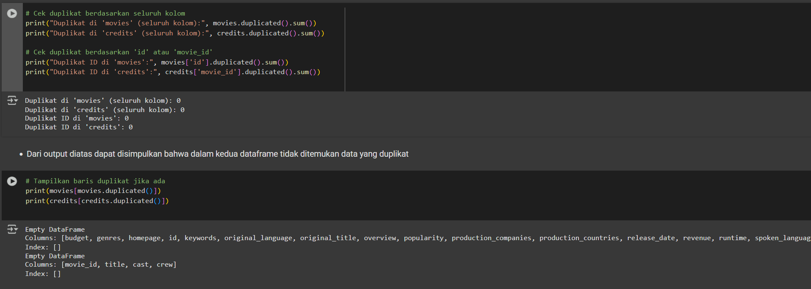
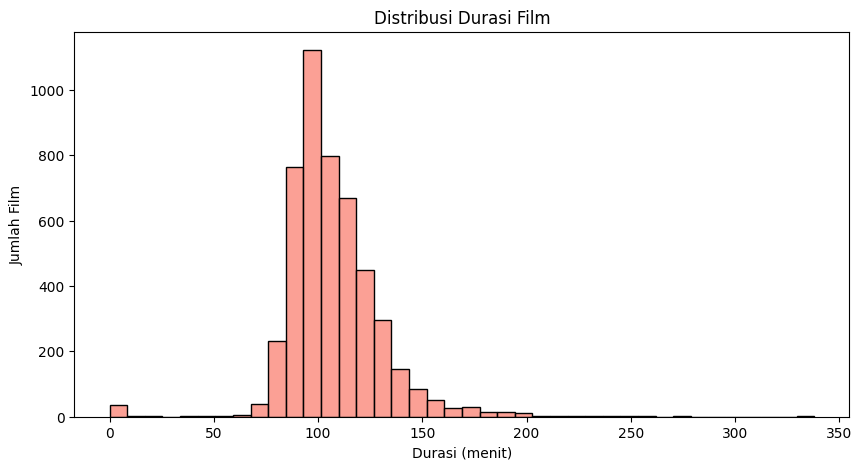

# Recommendation-System

# Laporan Proyek Machine Learning - Yuda Reyvandra Herman

## Domain Proyek

Industri perfilman saat ini mengalami pertumbuhan yang sangat pesat, baik dari segi jumlah produksi film maupun platform distribusinya. Dengan hadirnya layanan streaming digital seperti Netflix, Disney+, Amazon Prime, dan lainnya, pengguna kini dihadapkan pada ribuan pilihan film dalam berbagai genre, bahasa, dan gaya produksi. Hal ini justru memunculkan tantangan baru: bagaimana pengguna bisa menemukan film yang sesuai dengan selera mereka secara cepat dan efisien, tanpa harus menelusuri seluruh katalog secara manual.

Salah satu solusi yang terbukti efektif dalam menjawab tantangan ini adalah sistem rekomendasi berbasis content-based filtering. Sistem ini bekerja dengan cara menganalisis konten atau atribut dari film, seperti genre, sinopsis (overview), kata kunci (keywords), pemeran (cast), dan kru (crew) untuk menentukan kesamaan antarfilm, lalu merekomendasikan film yang mirip dengan film yang disukai atau pernah ditonton oleh pengguna (Aggarwal, 2016).

Pengembangan sistem rekomendasi ini bertujuan untuk meningkatkan pengalaman pengguna dalam menjelajahi film yang sesuai dengan preferensi mereka. Selain itu, teknologi ini juga dapat membantu platform streaming atau penyedia layanan hiburan untuk meningkatkan retensi pengguna, personalisasi konten, dan efisiensi dalam promosi film (Netflix Technology Blog, 2019).

\*\*Referensi

- Aggarwal, C. C. (2016). Recommender systems: The textbook. Springer. https://doi.org/10.1007/978-3-319-29659-3
- Netflix Technology Blog. (2019, January). Recommender systems at Netflix. https://netflixtechblog.com

## Business Understanding

Dalam industri hiburan digital, pengguna sering kewalahan memilih tontonan karena banyaknya pilihan film yang tersedia. Hal ini dapat menurunkan kepuasan dan engagement pengguna.

Layanan streaming membutuhkan sistem yang mampu merekomendasikan film secara personal. Rekomendasi berbasis popularitas tidak cukup karena tidak mempertimbangkan preferensi unik tiap pengguna.

Dengan memanfaatkan data seperti genre, sinopsis, kata kunci, dan pemeran, sistem rekomendasi berbasis content-based filtering dapat membantu menyajikan tontonan yang relevan. Solusi ini meningkatkan pengalaman pengguna sekaligus mendukung strategi bisnis seperti retensi dan personalisasi layanan.

### Problem Statements

- Bagaimana memanfaatkan atribut film seperti genre, sinopsis, kata kunci, dan pemeran utama untuk mengukur kesamaan antarfilm dalam model content-based filtering.
- Bagaimana cara mengembangkan sistem rekomendasi film yang mampu menyajikan rekomendasi secara personal berdasarkan film yang ditonton atau dicari pengguna sebelumnya.

### Goals

- Membangun sistem rekomendasi film berbasis content-based filtering.

  Sistem ini dirancang untuk merekomendasikan film kepada pengguna dengan menganalisis kesamaan antarfilm berdasarkan kontennya, bukan berdasarkan perilaku pengguna lain. Tujuannya adalah menciptakan pengalaman menonton yang lebih personal dan relevan.
- Mengolah dan mengekstrak informasi penting dari atribut film.

  Informasi seperti genre, sinopsis, kata kunci, pemeran, dan kru produksi akan diproses menjadi fitur yang dapat digunakan dalam perhitungan kemiripan film. Langkah ini penting untuk memastikan sistem memahami karakteristik setiap film secara mendalam.

### Solution statements

- Menggunakan ***TF-IDF dan/atau CountVectorizer** untuk mengubah teks deskriptif (seperti sinopsis dan keywords) menjadi representasi numerik yang dapat digunakan untuk menghitung kemiripan antarfilm.
- Mengukur kesamaan antarfilm menggunakan **cosine similarity**, untuk menghasilkan daftar rekomendasi berdasarkan film yang pernah disukai pengguna.
- Menyusun pipeline evaluasi sistem menggunakan metode manual review dan metrik seperti **precision@k** atau analisis **top-n recommendation**, untuk mengukur relevansi hasil rekomendasi.

## Data Understanding

Dataset yang digunakan terdiri dari dua file, yaitu “movies.csv” dan “credits.csv”, dengan total 4800+ entri film. Dataset ini berisi informasi terkait berbagai aspek film seperti judul, genre, sinopsis, tanggal rilis, bahasa, popularitas, dan data finansial seperti anggaran serta pendapatan. File credits.csv melengkapi informasi dengan data pemeran (cast) dan kru utama (crew), termasuk sutradara. Kedua dataset ini digunakan untuk membangun sistem rekomendasi film berbasis content, dengan fokus pada analisis kesamaan antarfilm berdasarkan atribut-atribut tersebut.

## credit.csv
| Keterangan   | Detail                                                                                                      |
| ------------ | ----------------------------------------------------------------------------------------------------------- |
| Jumlah Data  | 4.803 baris                                                                                                 |
| Jumlah Fitur | 4 kolom                                                                                                     |
| Format       | CSV                                                                                                         |
| Sumber       | [Kaggle - The Movies Dataset](https://www.kaggle.com/datasets/rounakbanik/the-movies-dataset)               |

## movies.csv 
| Keterangan   | Detail                                                                                                      |
| ------------ | ----------------------------------------------------------------------------------------------------------- |
| Jumlah Data  | 4.803 baris                                                                                                 |
| Jumlah Fitur | 20 kolom                                                                                                     |
| Format       | CSV                                                                                                         |
| Sumber       | [Kaggle - The Movies Dataset](https://www.kaggle.com/datasets/rounakbanik/the-movies-dataset)               |

### Fitur (credit.csv)
| Kolom     | Deskripsi                          |
| --------- | ---------------------------------- |
| movie_id  | Unique ID buat tiap film           |
| title     | Judul film                         |
| cast      | Daftar pemeran/aktor film          |
| crew      | Daftar kru produksi film           |

### Fitur (movies.csv)
| No. | Kolom                  | Deskripsi                                                               |
| --- | ---------------------- | ----------------------------------------------------------------------- |
| 1   | `budget`               | Anggaran produksi film                                                  |
| 2   | `genres`               | List genre film                                                         |
| 3   | `homepage`             | URL situs resmi film (kalau ada).                                       |
| 4   | `id`                   | ID unik untuk setiap film                                               |
| 5   | `keywords`             | Kata kunci terkait isi/tema film                                        |
| 6   | `original_language`    | Bahasa asli saat film diproduksi (contoh: `en`, `fr`, `ko`, dll).       | 
| 7   | `original_title`       | Judul asli film (kadang beda sama `title`, terutama untuk film asing).  |
| 8   | `overview`             | Ringkasan atau sinopsis film.                                           |
| 9   | `popularity`           | Skor popularitas (kayaknya dihitung dari views, rating, dll).           |
| 10  | `production_companies` | List perusahaan produksi film                                           |
| 11  | `production_countries` | Negara tempat produksi film                                             |
| 12  | `release_date`         | Tanggal rilis film.                                                     |
| 13  | `revenue`              | Pendapatan kotor film                                                   |
| 14  | `runtime`              | Durasi film dalam menit.                                                |
| 15  | `spoken_languages`     | Bahasa yang digunakan dalam film                                        |
| 16  | `status`               | Status film (contoh: `Released`, `Post Production', 'Rumored`).         |
| 17  | `tagline`              | Slogan atau tagline dari film.                                          |
| 18  | `title`                | Judul film yang umum diketahui.                                         |
| 19  | `vote_average`         | Rata-rata rating dari user.                                             |
| 20  | `vote_count`           | Total jumlah vote yang diterima.                                        |

### Missing Value (credit.csv)
| Kolom     | Jumlah Missing Value |
| --------- | -------------------- |
| movie_id  | 0                    |
| title     | 0                    |
| cast      | 0                    |
| crew      | 0                    |

- Dari hasil pengecekan missing values pada 'credits.csv', tidak ditemukan missing value pada semua kolom dan baris yang ada.

### Missing Value (movies.csv)
| Kolom                 | Jumlah Missing Value |
| --------------------- | -------------------- |
| budget                | 0                    |
| genres                | 0                    |
| homepage              | 3.091                |
| id                    | 0                    |
| keywords              | 0                    |
| original\_language    | 0                    |
| original\_title       | 0                    |
| overview              | 3                    |
| popularity            | 0                    |
| production_companies | 0                    |
| production_countries | 0                    |
| release_date         | 1                    |
| revenue               | 0                    |
| runtime               | 2                    |
| spoken_languages     | 0                    |
| status                | 0                    |
| tagline               | 844                  |
| title                 | 0                    |
| vote_average         | 0                    |
| vote_count           | 0                    |

- Dari hasil pengecekan missing values pada 'movies.csv', ditemukan banyak missing value seperti pada kolom homepage, overview, release date, runtime, tagline.
- 3091 missing value dalam kolom 'homepage'
- 3 missing value dalam kolom 'overview'
- 1 missing value dalam kolom 'release_date'
- 2 missing value dalam kolom 'runtime'
- 844 missing value dalam kolom 'tagline'

#### Duplicated Data

- Dari gambar diatas dapat disimpulkan bahwa tidak ada data duplikat dalam kedua dataset yang sedang dianalisis. Hasil dari movies.duplicated().sum() dan credits.duplicated().sum()menunjukkan angka 0, yang artinya tidak ada satupun baris yang sama atau duplikat di seluruh dataset. Selain itu, saat dicek lebih lanjut dengan movies[movies.duplicated()] dan credits[credits.duplicated()] hasilnya juga kosong.

### Exploratory Data Analysis

### Correlation Heatmap
Menampilkan korelasi antar fitur numerik dengan target 'Stroke'

- Usia ('age') menunjukkan korelasi positif tertinggi dengan stroke (0.25) dibandingkan fitur lain, menunjukkan bahwa semakin tua usia seseorang, semakin tinggi kemungkinan untuk mengalami stroke.

## Data Preparation

### Data Cleaning
- Mengisi missing value pada kolom 'bmi' menggunakan median
- Menghapus kategori 'other' pada kolom 'gender', karena hanya ada 2 gender saja di dunia ini, yaitu laki-laki dan perempuan

### Data Preprocessing
- Mengubah fitur kategorikal menjadi fitur numerikal menggunakan LabelEncoder
- Melakukan feature scaling pada fitur numerikal dengan metode standarisasi (z-score)
  
### Data Splitting
- Melakukan pemisahan data fitur (X) dan label (y)
- Membagi data latih dan data uji menjadi 8:2 

### Data Balancing 
- Menerapkan SMOTE untuk mem-balance data yang ada, karena data sebelumnya sangat imbalance sehingga model nantinya akan cenderung memprediksi kelas mayoritas
- SMOTE hanya untuk data training

## Modeling
Pada tahap Modeling, digunakan tiga algoritma: Logistic Regression, SVM, dan ANN, dengan data yang telah diseimbangkan menggunakan SMOTE untuk mengatasi ketimpangan kelas antara kasus stroke dan non-stroke.

### Tahapan dan Parameter Pemodelan
- Import library dan model dari sklearn, termasuk Logistic Regression, SVM, ANN, dan metrik evaluasi seperti accuracy, ROC AUC, classification report, dan confusion matrix.
- Definisikan model dalam dictionary models dengan parameter:
    - Logistic Regression pakai max_iter=1000 supaya training convergen.
    - SVM pakai probability=True supaya bisa output probabilitas.
    - ANN pakai hidden_layer_sizes=(32,16), max_iter=1000, dan random_state=42 untuk konfigurasi jaringan dan kestabilan training.
- Lakukan training model menggunakan data yang sudah di-balance dengan SMOTE (X_train_smote dan y_train_smote).
- Prediksi kelas dan probabilitas pada data uji (X_test) menggunakan model yang sudah dilatih.
- Hitung metrik evaluasi yaitu accuracy, ROC AUC (kalau tersedia), classification report (precision, recall, f1-score), dan confusion matrix.
- Simpan hasil evaluasi tiap model ke dalam dictionary results untuk memudahkan perbandingan performa.
- Cetak hasil metrik evaluasi agar mudah melihat performa masing-masing model.

### Cara Kerja Model
- **Logistic Regression** = Logistic Regression merupakan salah satu metode klasifikasi yang berbasis pada model regresi linear, namun hasil akhirnya ditransformasikan menggunakan fungsi sigmoid. **Fungsi sigmoid** ini mengubah output linear menjadi nilai probabilitas antara 0 dan 1, yang kemudian digunakan untuk menentukan kelas dari data (biasanya dengan threshold 0.5). Secara konsep, algoritma ini menggunakan **transformasi log-odds**, yang merepresentasikan hubungan antara kombinasi fitur dengan kemungkinan terjadinya suatu peristiwa.
- **Support Vector Machine** = SVM itu fokus buat nyari **hyperplane** terbaik yang bisa misahin dua kelas data dengan margin seluas mungkin. Artinya, model ini mencari batas pemisah yang paling jauh dari titik-titik data terdekat dari masing-masing kelas, yang disebut sebagai **support vectors**. Kalau data nggak bisa dipisahin secara linear, SVM bisa pakai **kernel trick** buat merubah data ke dimensi yang lebih tinggi, biar bisa dipisahin dengan **hyperplane**.
- **Artificial Neural Network** = ANN atau jaringan saraf tiruan. Dalam kasus ini, saya menggunakan **Multilayer Perceptron (MLP)** dengan **dua hidden layer: satu dengan 32 neuron dan satu lagi dengan 16 neuron**. Data masuk dari input layer, lalu diproses di setiap neuron pada hidden layers, lewat operasi linear + aktivasi non-linear. Hasil akhirnya keluar di output layer sebagai probabilitas klasifikasi. ANN belajar lewat **backpropagation**, yaitu proses update bobot berdasarkan seberapa besar error yang dihasilkan, supaya model makin akurat melakukan prediksi di iterasi berikutnya.

### Logistic Regression
Kelebihan:
- Sederhana dan mudah diinterpretasi: Cocok untuk memahami hubungan antar variabel.
- Cepat dilatih: Komputasinya ringan, cocok untuk dataset kecil-menengah.
- Bekerja baik jika hubungan antar fitur dan target bersifat linier.
- Output probabilistik: Menghasilkan probabilitas prediksi, berguna untuk klasifikasi berbasis ambang batas (thresholding).

Kekurangan:
- Tidak cocok untuk hubungan non-linier (kecuali dimodifikasi dengan polynomial features).
- Sensitif terhadap outlier dan multikolinearitas.
- Kurang akurat dibanding model kompleks jika data sangat kompleks.

### Support Vector Machine 
Kelebihan:
- Akurasi tinggi terutama pada data yang kompleks dan berdimensi tinggi.
- Efektif pada data non-linier dengan penggunaan kernel (misalnya RBF, polynomial).
- Robust terhadap overfitting terutama pada dataset dengan fitur banyak dan jumlah data terbatas.

Kekurangan:
- Lambat pada dataset besar (scalability buruk).
- Pemilihan kernel dan tuning parameter seperti C dan gamma cukup rumit.
- Sulit diinterpretasi, tidak cocok untuk aplikasi yang memerlukan transparansi model.

### Artificial Neural Network
Kelebihan:
- Sangat fleksibel dan mampu menangkap hubungan non-linier yang kompleks.
- Mampu belajar dari data besar dengan banyak fitur.
- Bisa menghasilkan prediksi yang sangat akurat jika dilatih dengan benar.
  
Kekurangan:
- Butuh waktu dan sumber daya komputasi besar.
- Tuning hyperparameter (jumlah neuron, layer, learning rate, dll.) bisa rumit.
- Kurang interpretatif (dikenal sebagai "black-box model").

## Evaluation
| **Metrik**    | **Deskripsi**                                                                                                                                                                                                            |
| ------------- | ------------------------------------------------------------------------------------------------------------------------------------------------------------------------------------------------------------------------ |
| **Accuracy**  | Rasio prediksi yang benar dari seluruh prediksi. Pada kasus ini, Logistic Regression memberikan akurasi tertinggi (77.98%), artinya model ini paling banyak menghasilkan prediksi yang benar secara keseluruhan.         |
| **Precision** | Dari seluruh prediksi stroke, berapa yang benar-benar stroke. SVM dan ANN punya precision rendah untuk kelas stroke, menandakan banyak false positive. Logistic Regression sedikit lebih baik, tapi tetap belum optimal. |
| **Recall**    | Dari seluruh kasus stroke asli, berapa banyak yang berhasil dideteksi. Logistic Regression punya **recall tinggi (70%)**, artinya cukup bagus dalam mendeteksi kasus stroke walau dengan risiko false positive.          |
| **F1-Score**  | Rata-rata harmonis antara precision dan recall. Karena model Logistic Regression punya balance antara keduanya, F1-nya (24%) jadi yang paling mending dibanding dua model lain.                                          |

### Hasil evaluasi model 
| Model                   | Kelas | Accuracy | Precision | Recall | F1-Score |
| ----------------------- | ----- | -------- | --------- | ------ | -------- |
| **Logistic Regression** | 0     | 0.7798   | 0.98      | 0.78   | 0.87     |
|                         | 1     |          | 0.14      | 0.70   | 0.24     |
| **SVM**                 | 0     | 0.7407   | 0.95      | 0.77   | 0.85     |
|                         | 1     |          | 0.04      | 0.18   | 0.06     |
| **ANN**                 | 0     | 0.1145   | 0.99      | 0.07   | 0.13     |
|                         | 1     |          | 0.05      | 0.98   | 0.10     |

### Confussion Matrix
**Logistic Regression**

**Support Vector Machine**

**Artificial Neural Network**

### ROC Comparison

- Kurva ROC yang menampilkan trade-off antara true positive rate dan false positive rate, memberikan perspektif lebih lanjut terkait kemampuan deteksi positif dari setiap model. Visualisasi ini membantu mengidentifikasi model yang paling seimbang antara akurasi umum dan sensitivitas terhadap kelas minoritas.

### Feature Importance 
Gambar ini menampilkan fitur apa yang paling penting untuk model ini menggunakan **Logistic Regression**

- Berdasarkan hasil pada gambar, fitur yang paling berpengaruh terhadap kemungkinan stroke adalah usia (age) dengan koefisien paling besar positif, menandakan bahwa semakin tua seseorang, semakin tinggi risikonya

**Tambahan**
- Logistic regreession = Model ini menunjukkan performa yang paling seimbang. Dengan akurasi sebesar 77.98% dan skor ROC AUC sebesar 0.78, model ini mampu mendeteksi kelas minoritas (label 1) dengan recall yang cukup tinggi (0.70).
- Support Vector Machine (SVM) = SVM menghasilkan akurasi sebesar 74.07% namun menunjukkan performa yang buruk dalam mengenali kelas minoritas. Dengan recall hanya 0.18 untuk label 1 dan ROC AUC 0.45, model ini memiliki kecenderungan kuat untuk bias terhadap kelas mayoritas
- Artificial Neural Network = Model ANN menunjukkan performa yang sangat rendah dengan akurasi hanya sebesar 11.45%. Meskipun recall untuk kelas minoritas terlihat tinggi (0.98), hal ini disebabkan oleh model yang cenderung memprediksi sebagian besar data sebagai kelas positif, seperti terlihat dari confusion matrix-nya.

**Semua yang saya bahas diatas sudah sesuai dengan konteks data, problem statement, dan solusi yang diinginkan**

## Kesimpulan 
Berdasarkan keseluruhan proses analisis dan pemodelan yang telah dilakukan, Machine learning bisa membantu dalam mengidentifikasi pola risiko stroke dari berbagai data pasien, seperti data demografi, gaya hidup, dan kondisi kesehatan. Model-model yang umum dipakai, seperti Logistic Regression, Random Forest, atau SVM, bisa memberikan prediksi yang cukup akurat selama data yang digunakan lengkap dan sudah diproses dengan baik. Faktor-faktor utama yang memengaruhi risiko stroke biasanya meliputi tekanan darah tinggi, kadar kolesterol, usia, diabetes, dan kebiasaan merokok. Dengan adanya prediksi ini, dokter dan pasien dapat melakukan deteksi dini sehingga tindakan pencegahan bisa diambil sebelum stroke benar-benar terjadi, yang tentu saja sangat penting untuk menyelamatkan nyawa. Namun, tetap perlu diingat bahwa machine learning hanya alat bantu dan hasilnya harus dikombinasikan dengan evaluasi medis dari dokter sebelum mengambil keputusan akhir. Jadi, penggunaan machine learning dalam prediksi risiko stroke membuka peluang besar untuk meningkatkan efisiensi dan ketepatan dalam pencegahan stroke, yang menjanjikan masa depan kesehatan yang lebih baik.

