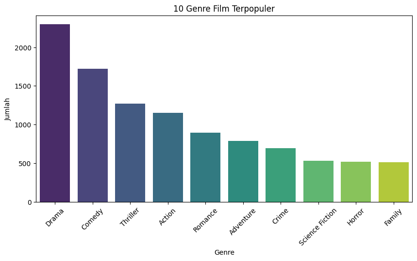
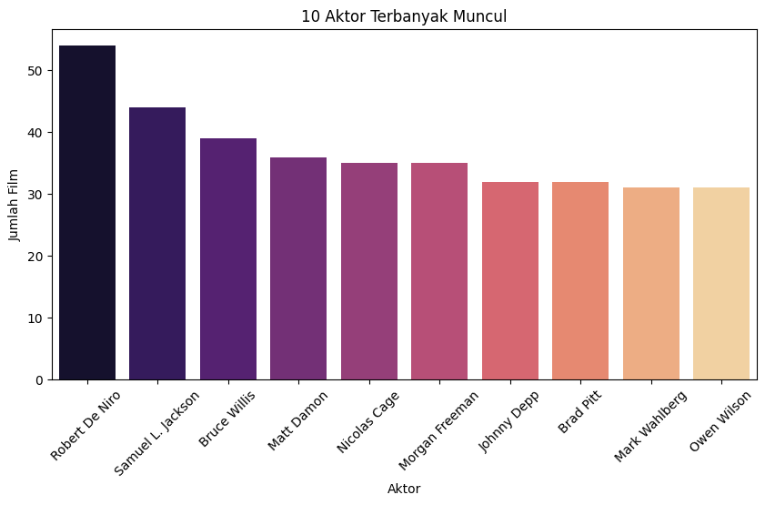
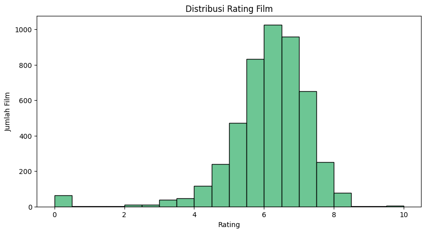
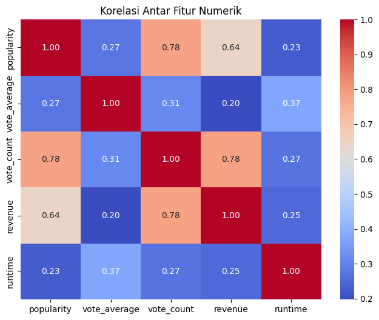
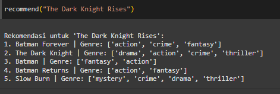
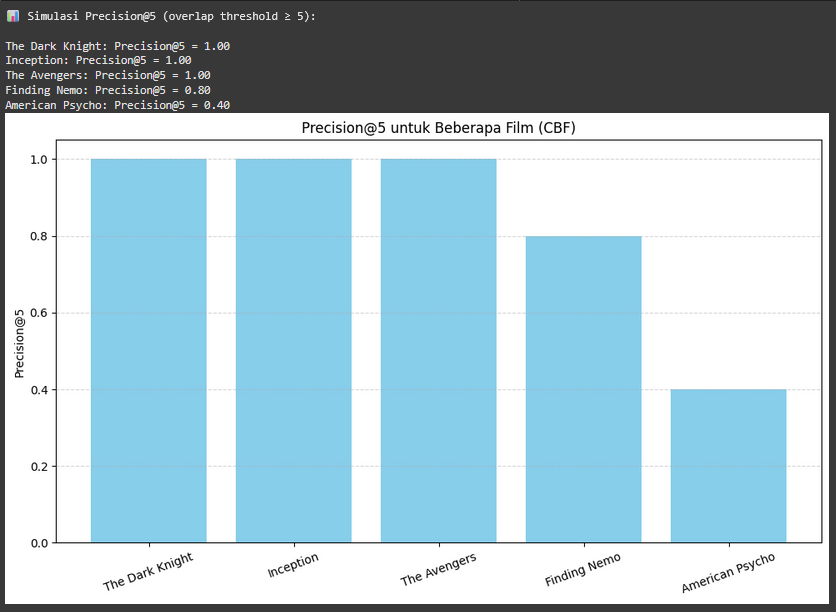
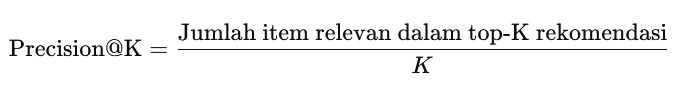

# Recommendation-System

# Laporan Proyek Machine Learning - Yuda Reyvandra Herman

## Domain Proyek

Industri perfilman saat ini mengalami pertumbuhan yang sangat pesat, baik dari segi jumlah produksi film maupun platform distribusinya. Dengan hadirnya layanan streaming digital seperti Netflix, Disney+, Amazon Prime, dan lainnya, pengguna kini dihadapkan pada ribuan pilihan film dalam berbagai genre, bahasa, dan gaya produksi. Hal ini justru memunculkan tantangan baru: bagaimana pengguna bisa menemukan film yang sesuai dengan selera mereka secara cepat dan efisien, tanpa harus menelusuri seluruh katalog secara manual.

Salah satu solusi yang terbukti efektif dalam menjawab tantangan ini adalah sistem rekomendasi berbasis content-based filtering. Sistem ini bekerja dengan cara menganalisis konten atau atribut dari film, seperti genre, sinopsis (overview), kata kunci (keywords), pemeran (cast), dan kru (crew) untuk menentukan kesamaan antarfilm, lalu merekomendasikan film yang mirip dengan film yang disukai atau pernah ditonton oleh pengguna (Aggarwal, 2016).

Pengembangan sistem rekomendasi ini bertujuan untuk meningkatkan pengalaman pengguna dalam menjelajahi film yang sesuai dengan preferensi mereka. Selain itu, teknologi ini juga dapat membantu platform streaming atau penyedia layanan hiburan untuk meningkatkan retensi pengguna, personalisasi konten, dan efisiensi dalam promosi film (Netflix Technology Blog, 2019).

\*\*Referensi

- Aggarwal, C. C. (2016). Recommender systems: The textbook. Springer. https://doi.org/10.1007/978-3-319-29659-3
- Netflix Technology Blog. (2019, January). Recommender systems at Netflix. https://netflixtechblog.com

## Business Understanding

Dalam industri hiburan digital, pengguna sering kewalahan memilih tontonan karena banyaknya pilihan film yang tersedia. Hal ini dapat menurunkan kepuasan dan engagement pengguna.

Layanan streaming membutuhkan sistem yang mampu merekomendasikan film secara personal. Rekomendasi berbasis popularitas tidak cukup karena tidak mempertimbangkan preferensi unik tiap pengguna.

Dengan memanfaatkan data seperti genre, sinopsis, kata kunci, dan pemeran, sistem rekomendasi berbasis content-based filtering dapat membantu menyajikan tontonan yang relevan. Solusi ini meningkatkan pengalaman pengguna sekaligus mendukung strategi bisnis seperti retensi dan personalisasi layanan.

### Problem Statements

- Bagaimana memanfaatkan atribut film seperti genre, sinopsis, kata kunci, dan pemeran utama untuk mengukur kesamaan antarfilm dalam model content-based filtering.
- Bagaimana cara mengembangkan sistem rekomendasi film yang mampu menyajikan rekomendasi secara personal berdasarkan film yang ditonton atau dicari pengguna sebelumnya.

### Goals

- Membangun sistem rekomendasi film berbasis content-based filtering.

  Sistem ini dirancang untuk merekomendasikan film kepada pengguna dengan menganalisis kesamaan antarfilm berdasarkan kontennya, bukan berdasarkan perilaku pengguna lain. Tujuannya adalah menciptakan pengalaman menonton yang lebih personal dan relevan.
- Mengolah dan mengekstrak informasi penting dari atribut film.

  Informasi seperti genre, sinopsis, kata kunci, pemeran, dan kru produksi akan diproses menjadi fitur yang dapat digunakan dalam perhitungan kemiripan film. Langkah ini penting untuk memastikan sistem memahami karakteristik setiap film secara mendalam.

### Solution statements

- Menggunakan ***TF-IDF dan/atau CountVectorizer** untuk mengubah teks deskriptif (seperti sinopsis dan keywords) menjadi representasi numerik yang dapat digunakan untuk menghitung kemiripan antarfilm.
- Mengukur kesamaan antarfilm menggunakan **cosine similarity**, untuk menghasilkan daftar rekomendasi berdasarkan film yang pernah disukai pengguna.
- Menyusun pipeline evaluasi sistem menggunakan metode manual review dan metrik seperti **precision@k** atau analisis **top-n recommendation**, untuk mengukur relevansi hasil rekomendasi.

## Data Understanding

Dataset yang digunakan terdiri dari dua file, yaitu “movies.csv” dan “credits.csv”, dengan total 4800+ entri film. Dataset ini berisi informasi terkait berbagai aspek film seperti judul, genre, sinopsis, tanggal rilis, bahasa, popularitas, dan data finansial seperti anggaran serta pendapatan. File credits.csv melengkapi informasi dengan data pemeran (cast) dan kru utama (crew), termasuk sutradara. Kedua dataset ini digunakan untuk membangun sistem rekomendasi film berbasis content, dengan fokus pada analisis kesamaan antarfilm berdasarkan atribut-atribut tersebut.

## credit.csv
| Keterangan   | Detail                                                                                                      |
| ------------ | ----------------------------------------------------------------------------------------------------------- |
| Jumlah Data  | 4.803 baris                                                                                                 |
| Jumlah Fitur | 4 kolom                                                                                                     |
| Format       | CSV                                                                                                         |
| Sumber       | [Kaggle - The Movies Dataset](https://www.kaggle.com/datasets/rounakbanik/the-movies-dataset)               |

## movies.csv 
| Keterangan   | Detail                                                                                                      |
| ------------ | ----------------------------------------------------------------------------------------------------------- |
| Jumlah Data  | 4.803 baris                                                                                                 |
| Jumlah Fitur | 20 kolom                                                                                                     |
| Format       | CSV                                                                                                         |
| Sumber       | [Kaggle - The Movies Dataset](https://www.kaggle.com/datasets/rounakbanik/the-movies-dataset)               |

### Fitur (credit.csv)
| Kolom     | Deskripsi                          |
| --------- | ---------------------------------- |
| movie_id  | Unique ID buat tiap film           |
| title     | Judul film                         |
| cast      | Daftar pemeran/aktor film          |
| crew      | Daftar kru produksi film           |

### Fitur (movies.csv)
| No. | Kolom                  | Deskripsi                                                               |
| --- | ---------------------- | ----------------------------------------------------------------------- |
| 1   | `budget`               | Anggaran produksi film                                                  |
| 2   | `genres`               | List genre film                                                         |
| 3   | `homepage`             | URL situs resmi film (kalau ada).                                       |
| 4   | `id`                   | ID unik untuk setiap film                                               |
| 5   | `keywords`             | Kata kunci terkait isi/tema film                                        |
| 6   | `original_language`    | Bahasa asli saat film diproduksi (contoh: `en`, `fr`, `ko`, dll).       | 
| 7   | `original_title`       | Judul asli film (kadang beda sama `title`, terutama untuk film asing).  |
| 8   | `overview`             | Ringkasan atau sinopsis film.                                           |
| 9   | `popularity`           | Skor popularitas (kayaknya dihitung dari views, rating, dll).           |
| 10  | `production_companies` | List perusahaan produksi film                                           |
| 11  | `production_countries` | Negara tempat produksi film                                             |
| 12  | `release_date`         | Tanggal rilis film.                                                     |
| 13  | `revenue`              | Pendapatan kotor film                                                   |
| 14  | `runtime`              | Durasi film dalam menit.                                                |
| 15  | `spoken_languages`     | Bahasa yang digunakan dalam film                                        |
| 16  | `status`               | Status film (contoh: `Released`, `Post Production', 'Rumored`).         |
| 17  | `tagline`              | Slogan atau tagline dari film.                                          |
| 18  | `title`                | Judul film yang umum diketahui.                                         |
| 19  | `vote_average`         | Rata-rata rating dari user.                                             |
| 20  | `vote_count`           | Total jumlah vote yang diterima.                                        |

### Missing Value (credit.csv)
| Kolom     | Jumlah Missing Value |
| --------- | -------------------- |
| movie_id  | 0                    |
| title     | 0                    |
| cast      | 0                    |
| crew      | 0                    |

- Dari hasil pengecekan missing values pada 'credits.csv', tidak ditemukan missing value pada semua kolom dan baris yang ada.

### Missing Value (movies.csv)
| Kolom                 | Jumlah Missing Value |
| --------------------- | -------------------- |
| budget                | 0                    |
| genres                | 0                    |
| homepage              | 3.091                |
| id                    | 0                    |
| keywords              | 0                    |
| original\_language    | 0                    |
| original\_title       | 0                    |
| overview              | 3                    |
| popularity            | 0                    |
| production_companies | 0                    |
| production_countries | 0                    |
| release_date         | 1                    |
| revenue               | 0                    |
| runtime               | 2                    |
| spoken_languages     | 0                    |
| status                | 0                    |
| tagline               | 844                  |
| title                 | 0                    |
| vote_average         | 0                    |
| vote_count           | 0                    |

- Dari hasil pengecekan missing values pada 'movies.csv', ditemukan banyak missing value seperti pada kolom homepage, overview, release date, runtime, tagline.
- 3091 missing value dalam kolom 'homepage'
- 3 missing value dalam kolom 'overview'
- 1 missing value dalam kolom 'release_date'
- 2 missing value dalam kolom 'runtime'
- 844 missing value dalam kolom 'tagline'

#### Duplicated Data

- Dari gambar diatas dapat disimpulkan bahwa tidak ada data duplikat dalam kedua dataset yang sedang dianalisis. Hasil dari movies.duplicated().sum() dan credits.duplicated().sum()menunjukkan angka 0, yang artinya tidak ada satupun baris yang sama atau duplikat di seluruh dataset. Selain itu, saat dicek lebih lanjut dengan movies[movies.duplicated()] dan credits[credits.duplicated()] hasilnya juga kosong.

### Exploratory Data Analysis

- **Distribusi Durasi Film**

Grafik menunjukkan bahwa sebagian besar film memiliki durasi antara 90 hingga 120 menit, dengan puncaknya di sekitar 100 menit. Ini mengindikasikan bahwa durasi film yang paling umum atau "standar" berada dalam rentang tersebut.

- **Top 10 Genre Terpopuler**

Genre "Drama" adalah yang paling populer secara signifikan, dengan jumlah film melebihi 2250. Ini menunjukkan bahwa film-film drama memiliki representasi yang jauh lebih tinggi dibandingkan genre lainnya dalam dataset ini.

- **Top 10 Aktor Terbanyak Muncul**

Robert De Niro muncul dalam lebih dari 50 film, menjadikannya aktor dengan penampilan terbanyak dalam dataset ini. Samuel L. Jackson berada di posisi kedua dengan lebih dari 40 film, menunjukkan konsistensi dan produktivitas tinggi dari kedua aktor tersebut.

- **Distribusi Rating Film**

Distribusi rating film menunjukkan puncak yang jelas antara rating 6 hingga 7.5. Ini mengindikasikan bahwa sebagian besar film dalam dataset ini menerima rating yang relatif baik atau di atas rata-rata.

- **Correlation Heatmap**

Terdapat korelasi positif yang kuat antara "popularity" dengan "vote_count" (0.78), dan juga antara "vote_count" dengan "revenue" (0.78). Selain itu, "popularity" dan "revenue" juga menunjukkan korelasi positif yang cukup kuat (0.64). Ini mengindikasikan bahwa film yang lebih populer cenderung memiliki jumlah suara (votes) yang lebih tinggi, dan pada gilirannya, cenderung menghasilkan pendapatan (revenue) yang lebih besar.

## Data Preparation

### Data Cleaning
- Mengisi missing value kolom teks 'homepage' Diisi dengan string kosong.
- Mengisi missing value kolom teks 'overview' Diisi dengan string kosong.
- Mengisi missing value kolom tanggal 'release_date' Di-convert ke datetime.
- Mengisi missing value kolom durasi 'runtime' NaN diisi pakai median runtime.
- Mengisi missing value kolom teks 'tagline' Diisi dengan string kosong.

### Data Preprocessing
- Melakukan operasi merge (penggabungan) antara dataframe movies dengan dataframe credits. 
- Melakukan pra-pemrosesan data tekstual dari beberapa kolom (genres, keywords, cast, crew, overview) dengan tujuan untuk menggabungkannya menjadi satu kolom tags. Proses ini melibatkan ekstraksi nama, normalisasi (mengubah ke huruf kecil, menghapus spasi), dan pembatasan jumlah item.
  
### Vectorization
- Menggunakan TfidfVectorizer untuk mengubah data tekstual dari kolom 'tags' menjadi representasi numerik (vektor).
- CountVectorizer(max_features=5000, stop_words='english') untuk mengubah teks tags menjadi vektor angka berdasarkan frekuensi kata.

### Cosine Similarity  
- untuk menghitung kesamaan kosinus (cosine similarity) antar semua pasangan vektor film.

## Modeling
Pada tahap Modeling, hanya menggunakan satu pendekatan sistem rekomendasi film, yaitu menggunakan **Content Based Filtering**

### Tahapan dan Parameter Pemodelan
- Import library dari sklearn, pandas, numpy, serta modul pemrosesan teks seperti CountVectorizer atau TfidfVectorizer dan cosine_similarity untuk penghitungan kemiripan.
- Lakukan preprocessing data:
    - Bersihkan nilai kosong pada kolom overview, tagline, homepage.
    - Ekstraksi informasi dari kolom genres, keywords, cast, dan crew (sutradara) menggunakan ast.literal_eval dan fungsi bantu.
    - Gabungkan kolom-kolom penting menjadi satu kolom tags.
- Lakukan vektorisasi teks menggunakan:
- Hitung kemiripan antarfilm menggunakan:
- Definisikan fungsi rekomendasi:
    - Ambil film yang ingin dicari, temukan vektor kemiripan tertinggi dengan film lainnya.
    - Urutkan dan tampilkan top-N film terdekat (paling mirip).
- Fungsi Rekomendasi ini akan cari judul film yang dimasukkan user, lalu cek skor kemiripan dengan semua film lain. Top skor tertinggi (selain dirinya sendiri) akan ditampilkan sebagai daftar rekomendasi film serupa.
- Tampilkan hasil rekomendasi berdasarkan input user (judul film), lengkap dengan rekomendasi film yang mirip dari sistem.

### Cara Kerja Model
- **Content-Based Filtering** = Model ini fokus pada isi atau konten dari tiap film. Jadi bukan berdasarkan perilaku user, tapi berdasarkan kemiripan fitur antarfilm (seperti genre, aktor, sinopsis, sutradara, dll). Model ini bikin representasi teks (dari kolom tags) jadi bentuk numerik pakai vectorizer, lalu pakai cosine similarity buat ngukur seberapa mirip satu film dengan yang lain.

Kelebihan:
- Model ini kasih rekomendasi yang customized berdasarkan informasi dari film yang udah diketahui. Jadi kalau user suka film dengan genre action dan aktor tertentu, sistem bakal nyari film lain yang mirip banget sama itu.
- Karena sistem cuma butuh informasi dari item (film), kita bisa langsung kasih rekomendasi bahkan kalau cuma satu user doang yang pakai, gak perlu nunggu ada banyak review/rating dari user lain.
- Karena fitur-fiturnya eksplisit (kayak genre, cast, overview), sistem ini relatif lebih gampang dijelasin kayak, “Film ini direkomendasikan karena mirip dengan film sebelumnya di genre dan aktornya.”
  
Kekurangan:
- Karena sistem cuma cari yang mirip dari konten, user bisa “terjebak” di zona yang sama. Misalnya dia suka thriller, ya direkomendasinya thriller terus. Kurang variasi atau serendipity gitu.
- Kalau datanya jelek atau informasinya kurang (misal overview atau genres kosong), maka hasil rekomendasinya bisa gak akurat. Jadi sangat tergantung pada kualitas preprocessing & representasi fitur.
- Gak bisa tangkap tren global atau preferensi kolektif, Misalnya ada film yang lagi viral atau disukai banyak orang, CBF gak akan tahu itu populer kecuali user udah pernah nonton film serupa. Jadi gak bisa manfaatin efek “social proof” kayak di collaborative filtering.

### Hasil Content Based Filtering

- Output menunjukkan bahwa sistem rekomendasi berhasil mengidentifikasi film-film yang sangat relevan dengan "The Dark Knight Rises", seperti "The Dark Knight", "Batman", "Batman Forever", dan "Batman Returns". Ini mengindikasikan bahwa model kemiripan yang dibangun (menggunakan TF-IDF dan cosine similarity pada tag film) bekerja dengan baik dalam menangkap esensi genre, aktor, sutradara, dan kata kunci film, sehingga menghasilkan rekomendasi yang koheren.
- Empat dari lima rekomendasi teratas adalah film Batman lainnya, menegaskan bahwa sistem sangat efektif dalam merekomendasikan bagian dari series yang sama atau film dengan tema dan genre yang sangat mirip. Kehadiran "Slow Burn" sebagai rekomendasi kelima, meskipun bukan bagian dari series Batman, menunjukkan bahwa ada kesamaan genre seperti 'mystery', 'crime', 'drama', dan 'thriller' yang juga dipertimbangkan oleh sistem.
  
## Evaluation
### Hasil evaluasi Content Based Filtering

- Hasil evaluasi menunjukkan bahwa sistem CBF memberikan rekomendasi sangat relevan untuk film-film populer seperti The Dark Knight, Inception, dan The Avengers dengan skor Precision@5 sebesar 1.00, menandakan kemiripan tinggi dalam genre, kata kunci, dan kru. Finding Nemo masih cukup akurat dengan skor 0.80, sedangkan American Psycho hanya mencapai 0.40, kemungkinan karena karakteristiknya yang lebih unik dan minim kesamaan konten dengan film lain dalam dataset.

### Precision@k
Precision@K mengukur proporsi item relevan (misalnya film yang mirip) yang berhasil direkomendasikan oleh sistem di antara K rekomendasi teratas.

### Formula 

### Cara Kerja 
- Sistem nyari hasil skor precision@k dari 5 film yang dijadikan test sample ('The Dark Knight','Inception','The Avengers','Finding Nemo','American Psycho') berdasarkan kemiripan konten (tags) gabungan dari genre, keywords, overview, cast, dan director.
- Untuk setiap film yang direkomendasikan itu, dicek berapa banyak kata kunci/tag yang sama dari setiap film test sample.
- Kalau jumlah tag yang overlap ≥ 5 → dianggap relevan.

### Jawaban untuk problem statement
1. Bagaimana memanfaatkan atribut film seperti genre, sinopsis, kata kunci, dan pemeran utama untuk mengukur kesamaan antarfilm dalam model content-based filtering.
   
   **Jawaban** : Model ini menggabungkan berbagai atribut penting seperti genre, overview, keywords, cast, dan crew (khususnya director) jadi satu kolom tags. Terus diubah jadi representasi vektor (TF-IDF), lalu menghitung similarity antar film pakai cosine similarity. Artinya, model secara langsung dan eksplisit sudah memanfaatkan atribut-atribut itu untuk mengukur kesamaan film.

3. Bagaimana cara mengembangkan sistem rekomendasi film yang mampu menyajikan rekomendasi secara personal berdasarkan film yang ditonton atau dicari pengguna sebelumnya.

   **Jawaban** : Model ini memberikan rekomendasi berdasarkan satu input film (misalnya, user nonton Inception, sistem kasih film yang mirip dari segi konten). Ini adalah bentuk content-based filtering yang personalized, karena output-nya disesuaikan dengan film yang pernah disukai user. Meskipun belum melibatkan data user secara eksplisit (kayak riwayat nonton), pendekatan ini tetap termasuk personalisasi berbasis item yang disukai.

## Kesimpulan 
Berdasarkan keseluruhan proses analisis dan pemodelan yang telah dilakukan, sistem rekomendasi berbasis Content-Based Filtering (CBF) terbukti mampu memberikan rekomendasi film yang cukup relevan berdasarkan kemiripan konten antar film, seperti genre, sinopsis, keywords, hingga informasi kru dan pemain. Evaluasi menggunakan metrik Precision@5 menunjukkan bahwa film dengan popularitas tinggi dan konten yang kaya cenderung mendapat rekomendasi yang sangat akurat, sedangkan film dengan karakteristik lebih niche menghasilkan skor yang lebih rendah. Ini menegaskan bahwa CBF sangat bergantung pada informasi deskriptif yang tersedia di dataset. Ke depan, sistem seperti ini punya potensi besar dalam membantu pengguna menemukan film yang sesuai preferensi mereka, meskipun idealnya dikombinasikan dengan pendekatan lain seperti collaborative filtering untuk hasil yang lebih seimbang dan personal.

